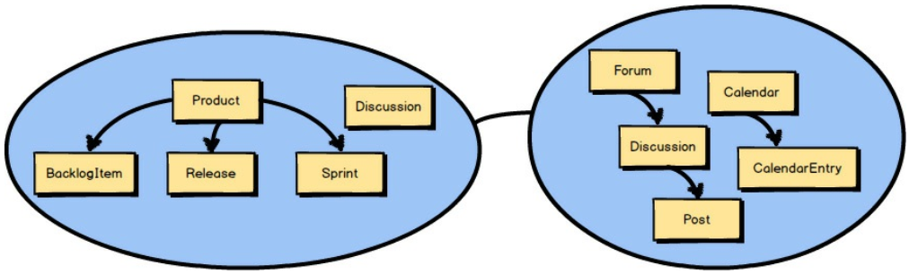

# Preface

- **Domain-Driven Design (DDD)** - A set of software **modeling tools**/patterns.
  - Drawing **_Context Maps_**.
  - Modeling the business process using **_Event Storming_**.

## What This Book Covers

### Strategic Tools (Design Phase)

- Chapter 2 - Foundation of DDD:
  - **_Bounded Contexts_**
  - **_Ubiquitous Language_**
- Chapter 3 - **_Subdomains_**
  - To deal with the complexity of integrating with existing **legacy systems**.
- Chapter 4 - **_Context Mapping_** (Diagram)

### Tactical Tools (Implementation Phase)

- Chapter 5 - Tactical modeling with **_Aggregates_**
  - Tactical modeling tool to be used with **_Aggregates_** is **_Domain Events_**.

# Chapter 1. DDD for Me

- Enabling us to perform at **scale**.
- **Strategic** tools
  - Can help you make **software design choices** and **integration decisions**.
- **Tactical** tools
  - Can help you **design** useful software that **accurately models** the business's unique operations.

## Will DDD Hurt?

- DDD is a set of **advanced techniques** to be used on **complex software** projects.
- **Note:** To learn DDD in **detail**, check out the **_Implementing Domain-Driven Design_** book.

## Good, Bad, and Effective Design

- **Nonexistent** design - No effort was put into software design, such as focusing only on completing the task/sprint board.
  - Uses **Scrum** to primarily control timelines rather than allow for one of Scrum's most important principles: **knowledge acquisition** (through **experimentation** and **collaborative learning**).
- **Common situations** caused by bad design:
  - Software projects are in **peril**, and entire teams are hired **to keep systems up and running**, **patching code and data** daily.
- **Potential problems** (ones that DDD can readily help teams avoid):
  - Developers trying to solve problems using technology **rather than careful thought and design**.
  - Database is given **to much priority** rather than business processes and operations.
  - Developers don't give proper emphasis to **naming objects and operations** according to the **business purpose**.
  - **Over-emphasis on project estimates** - Developers use the "task-board shuffle" rather than thoughtful design.
  - Developers house business logic in **user interface** components and **persistence** components.
    - \*Perform persistence operations in the middle of business logic.
  - **Broken**, **slow**, and **locking** database queries.
  - **Wrong abstractions**, where developers attempt to address all current and **imagined future needs** (Violating YAGNI) by **overly generalizing** solutions.
  - **Strongly coupled services** - Often leads to **broken business processes** and **unreconciled data**.
- Design is **inevitable**. The alternative to good design is bad design.

## Strategic Design (High Level, Big Picture)

- A context map of a bounded context:
  
- You can't apply tactical design in an effective way unless you begin with strategic design.
- Highlights **what is strategically important** to your business, **how to divide up the work** by importance, and **how to integrate** as needed.

### Key Concepts

- **_Bounded Contexts_**
  - A strategic design pattern for **segregating** domain models.
  - Within an explicitly _Bounded Context_, we develop a **_Ubiquitous Language_** as your **domain model**.
    - Important to engage with **_Domain Experts_** as you develop your model's _Ubiquitous Language_.
- **_Subdomains_** - Can help you deal with the **unbounded complexity of <u>legacy systems</u>**, and to improve your results on greenfield projects.
- **_Context Mapping_** - A technique to **integrate** multiple _Bounded Contexts_.

## Tactical Design (Low Level, Fine Detail)


- **_Aggregate_** pattern - Aggregate entities and value objects together into a **right-sized cluster**.
- **_Domain Events_** - Help you to **model explicitly** and to **share what has occurred within your model**.

# Chapter 2. Strategic Design with Bounded Contexts and the Ubiquitous Language

- DDD is primarily about **modeling** a _Ubiquitous Language_ in an explicitly _Bounded Context_.
- _Bounded Context_ is a **semantic contextual boundary**.
  - Components inside a _Bounded Context_ are **context specific**.
- When you are just **getting started**, your _Bounded Context_ is somewhat **conceptual** (think of it as part of your **_problem space_**).
- As your model starts to take on **deeper meaning** and **clarity**, your _Bounded Context_ will quickly transition to your **_solution space_**, with your model being **reflected as source code**.
- <u>What Is a Problem Space and a Solution Space?</u>
  - **Problem space:**
    - **High-level strategic analysis** and **DESIGN steps**.
    - Can use **simple diagrams** (e.g. **Context Maps**) as you discuss the high-level project drivers and note important **goals** and **risks**.
  - **Solution space:**
    - **IMPLEMENT** the solution.
    - Produce code that **supports integration with other _Bounded Contexts_**.
- **Model** inside the context boundary reflects a **language** (Ubiquitous Language) that is developed by the team working in the **_Bounded Context_**.


- **Boxes** inside the _Bounded Context_ represent the model, which may be implemented as **classes**.
- **_Core Domain_**
  - When the _Bounded Context_ is being developed as a **key strategic initiative** (killer feature).
  - **Choose wisely** what should be part of your Core Domain and what should not.
- Can think of **_Bounded Contexts_** as being **language boundaries**.
- <u>Bounded Contexts, Teams, and Source Code Repositories</u>
  - **Separate source code repository** for each _Bounded Context_.
  - One team could work on multiple _Bounded Contexts_, but **multiple teams should not work on a single _Bounded Context_**.
- **Other teams** would have a **different meaning for the same terminology**, because their business knowledge is within a **different context**.
- One **big reason** to use _Bounded Contexts_ is to solve a **common problem**:
  - Don't know **when to stop** piling more and more concepts into their domain models.
  - The language of the model becomes blurred.
  - Multiple languages in one large, confusing, unbounded model.
  - The product of trying to do too much, with too many people, in the wrong place.

## Domain Experts and Business Drivers

- There may be **hints** communicated by **business stakeholders** that could have been used to help the technical team make **better modeling choices**.
- **Department**, **team**, **business unit** or **divisions** can provide a **indication of where model boundaries should exist**.
- There is a trend toward grouping people **by project**.
  - Organized according to business drivers and under an **area of expertise**.

### Differences in Policies **by Function** (Example)


- Policy model:

  | Bounded context | Description                                                                                                                    |
  | --------------- | ------------------------------------------------------------------------------------------------------------------------------ |
  | Underwriting    | Expertise that is focused on underwriting, a policy is created based on the **evaluation of the risks** of the insured entity. |
  | Inspections     | Inspections area of expertise **inspecting a property** that is to be insured.                                                 |
  | Claims          | Claims area of expertise **tracks the request for payment** by the insured.                                                    |

- DDD emphasizes embracing such differences by **segregating** the different types into **different _Bounded Contexts_**.
- No need to name these UnderwritingPolicy, ClaimsPolicy, or InspectionsPolicy.

### Another Examples: What Is a Flight?

- In the **airline industry**, a "flight" can have **multiple meanings**:
  - A single takeoff and landing
  - Aircraft maintenance
  - Passenger ticketing
- Because each of these uses of "flight" is clearly **understood only by its context**, each should be modeled in a separate _Bounded Context_.

## [Problem] Case Study - Scrum-based agile project management application

- Unbounded model (Initial):

  

- Let's say we want to facilitate collaboration discussions within the **product team**.

  - Tenant, User, Permission models are needed to identify and authorize users.
  - Discussion represents one of the **collaborative tools** that we will support.

  

- Then, we decided that discussions belong within Forums and Discussions have Posts. Also we want to support Shared Calendars.

  

- And we need a way for **Tenants** to make **Payments**.

  - Will also sell tiered **support plans**, so we need a way to track support **incidences**.
  - Managed under an **Account**.

  

- And every product has a specific **Team** that works on the product.

  - Teams are composed of a single **Product Owner** and a number of **Team Members**.

  

- And shared calendars should not be limited to **bland** Calendar Entries.

  - Specific kinds of Calendar Entries, such as Reminders, Team Milestones, Planning and Retrospective Meetings, and Target Dates.

  

- The **LANGUAGE** is no longer purely about Scrum.
- For every named element, we might expect to have **two or three more** concepts to support those.

  

## Fundamental Strategic Design Needed

- Two fundamental strategic design tools:
  1. _Bounded Context_
     - \*Forces us to answer the question **"What is core?"**.
     - Should **hold closely all concepts** that are **core** to the strategic initiative.
  2. _Ubiquitous Language_
- **Note:** Concepts that survive the **stringent application of core-only filtering** are part of the _Ubiquitous Language_ of the team that owns the _Bounded Context_.

- How do we know **what is core?**

  - Have to bring together **two vital groups** of individuals into **one cohesive**, collaborative team: **_Domain Experts_** and **_software developers_**.
  - **Example:** In the domain of **Scrum**, count on the **_Domain Expert_** being a **Scrum Master** who thoroughly understands how Scrum is executed on a project.

  

- **Product Owner or Domain Expert?**
  - In some cases they **might be one** and the same.
  - This **doesn't mean** that the product owner is naturally an expert in the business's core competency.
- **_Domain Experts_**
  - Primarily focused on the business.
  - It's **their mental model** that we start with to **form the foundation** of the team's _Ubiquitous Language_.
- **_Developers_**
  - Need to carefully **resist the urge** to be so **technically centered**.
  - **Focus on Business Complexity, Not Technical Complexity**.
  - You are using DDD because the **business model complexity is high**.
  - Have to dig into the business model with **_Domain Experts_**.
- Should reject any tendency to allow documents to rule over conversation.
- The **best** Ubiquitous Language will be developed by a **collaborative feedback loop**.

## Challenge (Ask Questions) and Unify

- Question - What is core?
- Ask whether **each of the large-model concepts** adheres to the _Ubiquitous Language_ of Scrum.
- Models should **adhere to** the _Ubiquitous Language_ of Scrum.

  

  

- **Out of context** - Not part of the core Scrum language.

  

  

- **In context, but out of scope.** So, save it for later.

  - Calendar-based `Milestones`, `Retrospectives`, and the like.

  

- Assuming **threaded `Discussions`** will be part of the core model.

  - But, it requires a lot of **ancillary software component support**.
  - Hence, the full **Collaboration suite is out of context**.

  

- **Core Domain** - Essential model elements.

  - The model will **grow only as new concepts adhere to** the _Ubiquitous Language_ of Scrum.

  

## Developing a Ubiquitous Language (Model)

- **Don't limit** your _Core Domain_ to nouns alone.
  - Spoken language is composed of far more than nouns.
- But, when **constraining a Core Domain down to essential model**, we can focus on nouns.
- **Accelerate Your Discovery**
  - **Event Storming**
  - \***Concrete scenarios**. E.g.:
- Express your _Core Domain_ as a set of **concrete scenarios**.
  - Example (**Not a perfect example**, but it's a good start):
    - _Allow each backlog item to be committed to a sprint. The backlog item may be committed only if it is already scheduled for release. If it is already committed to a different sprint, it must be uncommitted first. When the commit completes, notify interested parties._
  - Describe how the very real software model components are used.
  - **Constraints** should also be part of the scenarios.
  - All about doing whatever is needed to **communicate well** on the team.
  - Be careful about the **time spent** in your domain-modeling efforts when it comes to **keeping documents**.
  - **Only do so as long as it is helpful** rather than burdensome.
- \*Ask the **WHO** question to clarify the initially stated scenario.
  - **Before** - _Allow each backlog item to be committed to a sprint..._
  - **After** - _The product owner commits each backlog item to a sprint..._
- In many cases, you should name each **persona** involved in the scenario and give some distinguishing attribute to other concepts such as to the backlog item and sprint.

### Putting Scenarios to Work

- \[Technique] **Specification by Example**, aka **Behavior-Driven Development (BDD)**.

  - It's to **collaboratively** develop and refine a _Ubiquitous Language_, model with a **shared understanding**, and determine whether your model **adheres to your specifications**.
  - By creating **acceptance tests**.
  - Restate the preceding scenario as an **executable specification**:

    ```
    Scenario: The product owner commits a backlog item to a sprint
      -- Conditions
      Given a backlog item that is scheduled for release
      And the product owner of the backlog item
      And a sprint for commitment
      And a quorum of team approval for commitment
      -- Action
      When the product owner commits the backlog item to the sprint
      -- Result
      Then the backlog item is committed to the sprint
      And the backlog item committed event is created
    ```

  - To **validating** the domain model.
  - Work best to maintain the **document** form of the **scenario** associated with the **validation code** in **comments**.

### What about the Long Haul?

- The best learning, or knowledge acquisition, **take place over a long period of time**.
- It is a **mistake** for teams to take the view that innovation ends when maintenance begins.
